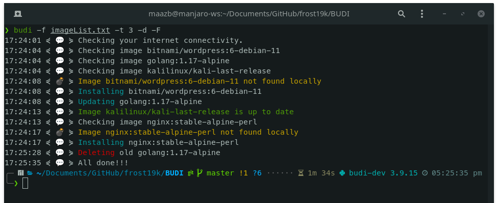

# BUDI 🐳
Batch Update Docker Images

**Usecase?**

I have a number of Docker Images that I like to keep updated. This is a simple script which checks for updates with `registry-1.docker.io/v2` & issues a `docker pull` if an update is found.

# Installation
1. Clone the repo
```Bash
❯ git clone https://github.com/frost19k/BUDI
```
2. Install BUDI
```Bash
❯ cd BUDI/
❯ pip3 install .
```

# Usage

```Bash
❯ budi -f imageList.txt
```

| Parameter    | Description                                         |
| :--          | :--                                                 |
| -f --file    | Input file containing docker image names (required) |
| -t --threads | Number of concurrent threads (default: 2)           |
| -d --delete  | Delete existing image after update (default: false) |
| -F --force   | Froce remove image after update (default: false)    |
| -v --version | Display version information                         |

- BUDI accepts a simple text file as input
- Each line must be an docker image of the form `repo/name:tag`
- `repo` & `tag` are optional
- For e.g.
```Bash
❯ cat imageList.txt
bitnami/wordpress:6-debian-11
golang:1.17-alpine
kalilinux/kali-last-release
nginx:stable-alpine-perl
```



# Thanks
Special thanks to [@gabrieldemarmiesse](https://github.com/gabrieldemarmiesse) for [python-on-whales](https://github.com/gabrieldemarmiesse/python-on-whales) which allowed me to completely avoid `subprocess`

Also, thanks to [@BMitch](https://stackoverflow.com/users/596285/bmitch) on StackOver flow for [this](https://stackoverflow.com/a/62627500).
